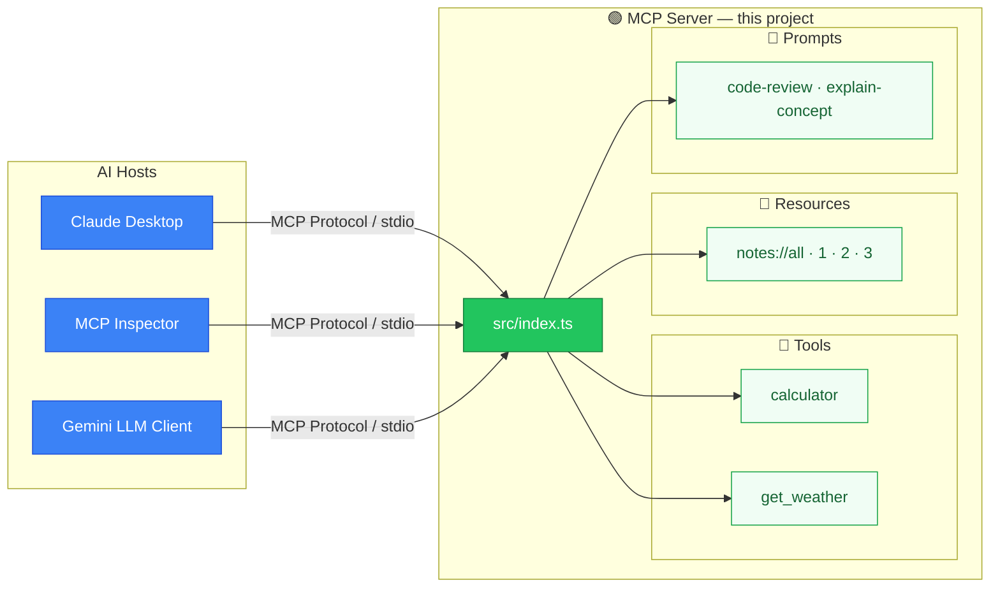

# 🤖 My Learning MCP Server

A hands-on MCP (Model Context Protocol) server built with **TypeScript** to learn the three core MCP primitives: **Tools**, **Resources**, and **Prompts**.

---

## 📚 What is MCP?

The **Model Context Protocol** is an open standard by Anthropic that lets AI models (like Claude) connect to external data sources, APIs, and custom logic in a standardized way.



---

## 🏗️ Project Structure

```
my-mcp-server/
├── src/
│   ├── index.ts              ← Main MCP server entry point
│   ├── client/
│   │   └── index.ts          ← 🤖 Gemini LLM client
│   ├── tools/
│   │   ├── calculator.ts     ← 🔧 Calculator tool
│   │   └── weather.ts        ← 🔧 Weather lookup tool
│   ├── resources/
│   │   └── notes.ts          ← 📄 Notes resource
│   └── prompts/
│       └── templates.ts      ← 💬 Prompt templates
├── spec/
│   ├── README.md             ← Spec index
│   ├── 01-architecture/      ← Server architecture design
│   └── 02-llm-client/        ← LLM client design
├── .env                      ← API keys (gitignored)
├── package.json
├── tsconfig.json
└── README.md
```

---

## 🧩 Core MCP Primitives

| Primitive | Purpose | Example |
|-----------|---------|---------|
| 🔧 **Tools** | Actions the AI can execute | Calculate math, fetch weather |
| 📄 **Resources** | Data the AI can read | Notes, files, DB records |
| 💬 **Prompts** | Reusable message templates | Code review, explain concept |

---

## 🚀 Getting Started

### 1. Install dependencies

```bash
npm install
```

### 2. Set up your API key (required for LLM client)

```bash
cp .env.example .env
```

Then open `.env` and add your Gemini API key:

```
GEMINI_API_KEY=your_key_here
```

> Get a free key at [aistudio.google.com/app/apikeys](https://aistudio.google.com/app/apikeys).
> See `spec/02-llm-client/design.md` for detailed setup steps.
>
> ⚠️ The MCP Inspector and server work without the key. Only `npm run client` needs it.

### 3. Run in dev mode (with hot reload)

```bash
npm run dev
```

### 4. Open the MCP Inspector (visual debugger in the browser)

```bash
npm run inspector
```

This opens a web UI where you can:
- Call tools interactively
- Browse and read resources
- Try out prompt templates

### 5. Run the Gemini LLM client (requires API key from step 2)

```bash
npm run client
```

Chat in plain English — Gemini will automatically call tools as needed.

### 6. Build for production

```bash
npm run build
```

---

## 🔧 Tools

> Tools let the AI execute actions (like making an API call or calculating math).

**How to use:**

- **In MCP Inspector** (`npm run inspector`): Go to the **Tools** tab, select a tool, enter the JSON arguments, and click "Run Tool".
- **In Gemini Client** (`npm run client`): Ask natural language questions like *"What is 25 x 4?"* or *"What's the weather in Tokyo?"* Gemini will automatically call the tool for you.

### `calculator`
Perform basic arithmetic operations.

**Input:**
```json
{
  "operation": "add" | "subtract" | "multiply" | "divide",
  "a": number,
  "b": number
}
```

**Example:** `{ "operation": "multiply", "a": 12, "b": 7 }` → `12 multiply 7 = 84`

---

### `get_weather`
Get current weather for a city (uses mock data for learning).

**Input:**
```json
{
  "city": "London",
  "unit": "celsius" | "fahrenheit"
}
```

**Example response:**
```json
{
  "city": "London",
  "temperature": "12°C",
  "humidity": "80%",
  "condition": "Cloudy",
  "timestamp": "2025-01-01T10:00:00.000Z"
}
```

---

## 📄 Resources

> Resources provide read-only data (like a file or database) for the AI to read.

**How to use:**

- **In MCP Inspector** (`npm run inspector`): Go to the **Resources** tab and click "List Resources" to see all available notes. Click on a specific URI (like `notes://1`) and click "Read Resource" to see its contents.
- **In Gemini Client**: *(Coming soon - currently the client only supports Tools, not Resources).*

Resources are accessed via URI:

| URI | Description |
|-----|-------------|
| `notes://all` | Summary list of all notes |
| `notes://1` | Note #1: "What is MCP?" |
| `notes://2` | Note #2: "MCP Transport Types" |
| `notes://3` | Note #3: "Why use Zod for validation?" |

---

## 💬 Prompts

> Prompts are reusable templates (like slash commands) that generate structured instructions for an LLM.

**How to use:**

- **In MCP Inspector** (`npm run inspector`): Go to the **Prompts** tab, select `code-review` or `explain-concept`, fill out the required arguments (e.g., `language: "TypeScript"`), and click "Get Prompt". It returns a highly detailed, ready-to-use prompt template.
- **In Claude Desktop**: These appear as slash commands. You type `/code-review` and it prompts you for the arguments.

### `code-review`
Generates a structured code review prompt.

| Argument | Required | Values |
|----------|----------|--------|
| `language` | ✅ | TypeScript, Python, Go, etc. |
| `focus` | ❌ | `security` \| `performance` \| `readability` \| `all` |

### `explain-concept`
Explains a technical concept at a chosen level.

| Argument | Required | Values |
|----------|----------|--------|
| `concept` | ✅ | e.g. "MCP Resources", "async/await" |
| `level` | ❌ | `beginner` \| `intermediate` \| `expert` |

---

## 🖥️ Connect to Claude Desktop

Add to your Claude Desktop config file:

**macOS:** `~/Library/Application Support/Claude/claude_desktop_config.json`

```json
{
  "mcpServers": {
    "my-mcp-server": {
      "command": "node",
      "args": ["/Users/YOUR_USERNAME/workspace/Personal/my-mcp-server/dist/index.js"]
    }
  }
}
```

Then run `npm run build` and restart Claude Desktop.

---

## 📖 Key Learnings

1. **stdio transport** — the server communicates via stdin/stdout; always log to `stderr`
2. **Always validate inputs** — use Zod's `safeParse` to catch bad data before it crashes your server
3. **Three primitives** — Tools (do), Resources (read), Prompts (template)
4. **McpError** — throw typed errors so the client receives structured error responses
5. **Capabilities** — declare what your server supports in the Server constructor

---

## 📚 Further Reading

- [Official MCP Docs](https://modelcontextprotocol.io)
- [MCP TypeScript SDK](https://github.com/modelcontextprotocol/typescript-sdk)
- [MCP Inspector](https://github.com/modelcontextprotocol/inspector)
