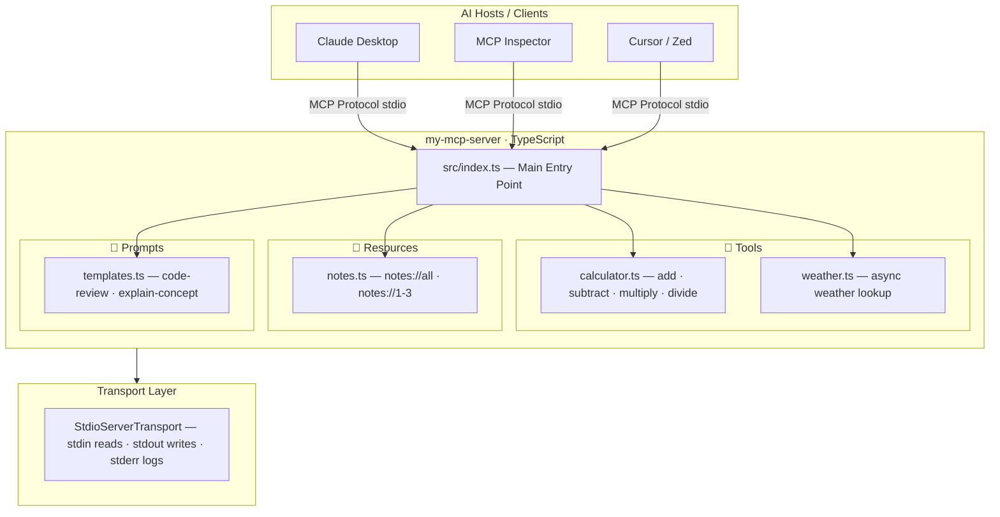

# 🗂️ MCP Server — Architecture Spec

> Covers the overall structure of `my-mcp-server` — how Tools, Resources, Prompts, and Transport fit together.

---

## Architecture Diagram



---

## Overview

`my-mcp-server` is a TypeScript-based MCP (Model Context Protocol) server that exposes
**Tools**, **Resources**, and **Prompts** to any compatible AI host (Claude Desktop, MCP Inspector, Cursor, etc.).

---

## MCP Primitives

### 🔧 Tools
Actions the AI can **execute**. Input is validated with Zod before any logic runs.

| Tool | File | Description |
|------|------|-------------|
| `calculator` | `src/tools/calculator.ts` | Arithmetic: add, subtract, multiply, divide |
| `get_weather` | `src/tools/weather.ts` | Async weather lookup (mock data) |

### 📄 Resources
Data the AI can **read**, addressed by URI.

| URI | File | Description |
|-----|------|-------------|
| `notes://all` | `src/resources/notes.ts` | Summary list of all notes |
| `notes://1` | `src/resources/notes.ts` | "What is MCP?" |
| `notes://2` | `src/resources/notes.ts` | "MCP Transport Types" |
| `notes://3` | `src/resources/notes.ts` | "Why use Zod for validation?" |

### 💬 Prompts
Reusable message **templates** with dynamic arguments.

| Prompt | File | Arguments |
|--------|------|-----------|
| `code-review` | `src/prompts/templates.ts` | `language` (required), `focus` (optional) |
| `explain-concept` | `src/prompts/templates.ts` | `concept` (required), `level` (optional) |

---

## Transport

Uses **`StdioServerTransport`** — the server is spawned as a subprocess by the host.
- Reads requests from `stdin`
- Writes responses to `stdout`
- All logs go to `stderr` (never `stdout` — would corrupt the JSON-RPC stream)

---

## File Structure

```
my-mcp-server/
├── spec/                          ← 📐 All design docs live here
│   ├── README.md                  ← Spec index
│   ├── 01-architecture/           ← You are here
│   │   └── design.md
│   └── 02-llm-client/
│       └── design.md
├── src/
│   ├── index.ts                   ← Main server entry point
│   ├── client/
│   │   └── index.ts               ← Gemini LLM client
│   ├── tools/
│   │   ├── calculator.ts
│   │   └── weather.ts
│   ├── resources/
│   │   └── notes.ts
│   └── prompts/
│       └── templates.ts
├── dist/                          ← Compiled output (gitignored)
├── .env                           ← API keys (gitignored)
├── package.json
├── tsconfig.json
└── README.md
```

---

## Design Decisions

| Decision | Rationale |
|----------|-----------|
| **TypeScript + ESM** | Type safety + modern module system compatible with the MCP SDK |
| **Zod for validation** | Runtime schema validation — never trust untyped input from an AI |
| **stdio transport** | Simplest transport for local tools; no network setup needed |
| **Modular file layout** | Each primitive (tool/resource/prompt) lives in its own file for easy extension |
| **`McpError` for errors** | Typed errors give the AI client structured, actionable error messages |

---

## Adding New Features

### Adding a new Tool
1. Create `src/tools/my-tool.ts` with a schema, definition, and handler
2. Import and register it in `src/index.ts` under `ListToolsRequestSchema` and `CallToolRequestSchema`

### Adding a new Resource
1. Add your data/logic to `src/resources/` 
2. Register the URI in `ListResourcesRequestSchema` and handle it in `ReadResourceRequestSchema`

### Adding a new Prompt
1. Add your template to `src/prompts/templates.ts`
2. Register it in `ListPromptsRequestSchema` and `GetPromptRequestSchema`
