# 🌍 Why MCP? (The "N × M" Problem)

> This document explains the industry problem that the **Model Context Protocol (MCP)** was invented to solve.

---

## The Nightmare Before MCP: Fragmented Plugins

Before MCP existed, if you wanted to build a "Weather tool" or a "Calculator tool" that an AI could use, you had to write custom integration code for every single AI platform. 

If you wanted your tool to work everywhere, you had to build it multiple times:
1. Write it for the **OpenAI / ChatGPT Plugin API**
2. Write it again for the **Anthropic / Claude ecosystem**
3. Write it again for the **Google / Gemini ecosystem**
4. Write it again for AI code editors like **Cursor** or **Zed**

If a new AI model was released, you had to rewrite your integration *again*. This created an exhausted, fragmented ecosystem where developers couldn't keep up.

```mermaid
graph TD
    subgraph "Before MCP: The N × M Chaos"
        W1[Your Weather Code] -->|"OpenAI API"| C[ChatGPT]
        W2[Your Weather Code] -->|"Anthropic API"| A[Claude]
        W3[Your Weather Code] -->|"Google API"| G[Gemini]
    end

    classDef bad fill:#ef4444,stroke:#b91c1c,color:#fff
    classDef ai fill:#3b82f6,stroke:#1d4ed8,color:#fff
    class W1,W2,W3 bad
    class C,A,G ai
```

---

## The Solution: MCP (The Universal "USB Port" for AI)

Anthropic created the **Model Context Protocol** and open-sourced it so that *everyone* could use it. It is a universal standard that works exactly like a USB-C port for computers.

Instead of writing custom code for every AI provider, the industry agreed on one standard protocol:

1. **You write your tool ONCE** as an MCP Server.
2. **Every AI Host** (Claude Desktop, Cursor, Zed, or a custom Gemini client) learns to speak the MCP protocol.
3. The AI Hosts plug directly into your server, and it magically works everywhere.

```mermaid
graph TD
    subgraph "After MCP: The Universal Standard"
        WMCP["🟢 Your MCP Server\n(Write once)"] -->|"Standard MCP Protocol"| C2[ChatGPT Host]
        WMCP -->|"Standard MCP Protocol"| A2[Claude Desktop]
        WMCP -->|"Standard MCP Protocol"| G2[Gemini Client]
        WMCP -->|"Standard MCP Protocol"| ED[Cursor / Zed Editors]
    end

    classDef good fill:#22c55e,stroke:#15803d,color:#fff
    classDef protocol fill:#f59e0b,stroke:#b45309,color:#fff
    classDef ai fill:#3b82f6,stroke:#1d4ed8,color:#fff
    
    class WMCP good
    class C2,A2,G2,ED ai
```

## What this means for your project

By building `my-mcp-server` using the official `@modelcontextprotocol/sdk`, your `calculator` and `get_weather` tools are future-proof. 

You built the server to learn it against Gemini (using `src/client/index.ts`), but you can now plug that exact same server into Claude Desktop or Cursor without changing a single line of your server code. You built a **universal plugin**.
