# 🤖 LLM Client Design Spec

> **File:** `src/client/index.ts`
> **Model:** Gemini 2.5 Flash (via `@google/generative-ai`)
> **Transport client → server:** stdio (spawned subprocess)

---

## Overview

The LLM Client connects Gemini to the MCP server, creating an interactive
terminal chat where the AI autonomously decides which tools to call.

---

## Diagram 1 — Ownership Boundaries

> **Green = you own it** · **Blue = Gemini API** · **Orange = Google Cloud**


---

## Diagram 2 — Internal Components

> Color = responsibility: **green** = setup · **yellow** = conversion · **blue** = AI · **purple** = I/O

```mermaid
graph TD
    A["① Validate API Key — read GEMINI_API_KEY from .env"]
    B["② Spawn MCP Server via StdioClientTransport"]
    C["③ Discover Tools — mcpClient.listTools()"]
    D["④ Convert Schemas — MCP Schema → Gemini FunctionDeclaration"]
    E["⑤ Init Gemini Model — getGenerativeModel(model, tools)"]
    F["⑥ Start Chat Session — model.startChat()"]
    G["⑦ Terminal Input — readline.question()"]
    H["⑧ Agentic Tool Loop — while functionCalls() exist"]

    A --> B --> C --> D --> E --> F --> G --> H
    H -->|"next message"| G

    classDef setup fill:#22c55e,stroke:#16a34a,color:#fff
    classDef convert fill:#eab308,stroke:#ca8a04,color:#fff
    classDef ai fill:#3b82f6,stroke:#2563eb,color:#fff
    classDef io fill:#a855f7,stroke:#9333ea,color:#fff
    classDef loop fill:#ef4444,stroke:#dc2626,color:#fff

    class A,B,C setup
    class D convert
    class E,F ai
    class G io
    class H loop
```



---

## Diagram 3 — Startup Sequence

> What happens between `npm run client` and the first `You:` prompt.

```mermaid
sequenceDiagram
    actor User as 👤 User
    participant T as Terminal
    participant C as 🟢 MCP Client
    participant S as 🟢 MCP Server
    participant G as 🔵 Gemini API

    User->>T: npm run client
    T->>C: starts process
    C->>C: read GEMINI_API_KEY from .env
    C->>S: spawn subprocess (tsx src/index.ts)
    S-->>C: ✅ MCP initialize handshake
    C->>S: listTools()
    S-->>C: [calculator, get_weather]
    C->>C: convert schemas → FunctionDeclarations
    C->>G: getGenerativeModel("gemini-2.5-flash", tools)
    G-->>C: model ready
    C->>C: model.startChat()
    C-->>User: 💬 "You:" prompt
```



---

## Diagram 4 — Live Agentic Loop (per message)

> Every arrow shows an actual function call or API request that happens at runtime.

```mermaid
sequenceDiagram
    actor User as 👤 User
    participant C as 🟢 MCP Client
    participant G as 🔵 Gemini 2.5 Flash
    participant S as 🟢 MCP Server

    User->>C: "what is 25×4 and weather in Tokyo?"

    rect rgb(219, 234, 254)
        note over C,G: Round 1 — Calculator
        C->>G: sendMessage(text + tool definitions)
        activate G
        G-->>C: functionCall: calculator({op:multiply, a:25, b:4})
        deactivate G
        C->>S: callTool("calculator", args)
        activate S
        S-->>C: "25 multiply 4 = 100"
        deactivate S
    end

    rect rgb(220, 252, 231)
        note over C,G: Round 2 — Weather
        C->>G: sendMessage(toolResult: "100")
        activate G
        G-->>C: functionCall: get_weather({city:"Tokyo"})
        deactivate G
        C->>S: callTool("get_weather", args)
        activate S
        S-->>C: {temp:"22°C", condition:"Partly Cloudy"}
        deactivate S
    end

    rect rgb(254, 243, 199)
        note over C,G: Round 3 — Final Answer
        C->>G: sendMessage(toolResult: weather data)
        activate G
        G-->>C: "25×4 is 100. Tokyo is 22°C, partly cloudy."
        deactivate G
    end

    C->>User: 🤖 prints final answer
    note over C,User: loops back to "You:" prompt
```



---

## Diagram 5 — End-to-End Story (for non-technical readers)

> From typing a command in the terminal to seeing the final answer.
> Each **row** = one phase. Each **phase** flows left → right.


> 🟢 **Green** = runs on your machine · 🔵 **Blue** = internet / Gemini · 🟡 **Yellow** = what you see in the terminal

---


## Key Design Decisions

| Decision | Rationale |
|----------|-----------|
| **Gemini 2.5 Flash** | Only model available on this billing project |
| **`model.startChat()`** | Keeps full conversation history across turns automatically |
| **Tools at model init** | Gemini requires tool defs at model creation time, not per-request |
| **stdio subprocess** | No separate server startup needed — client spawns it automatically |
| **`while` tool loop** | Gemini can chain multiple tool calls before giving a final text answer |

---

## Getting a Gemini API Key

> You need this before you can run the client. Takes ~2 minutes.

1. Go to **[aistudio.google.com/app/apikeys](https://aistudio.google.com/app/apikeys)**
2. Sign in with your Google account if prompted
3. Click **"Create API key"** (top right)
4. Choose **"Default Gemini Project"** (or any existing project)
5. Click **"Create key"** in the dialog
6. **Copy** the full key (starts with `AIza...`)
7. Open `.env` in your project and paste it:
   ```
   GEMINI_API_KEY=AIzaSy...your_key_here
   ```
8. Save the file — you're ready to run `npm run client`

> ⚠️ **If you see quota errors:** Enable billing on your Google Cloud project at
> [console.cloud.google.com/billing](https://console.cloud.google.com/billing).
> This does **not** charge you — it just unlocks the free tier quota.

---

## Environment Variables

| Variable | Required | Where |
|----------|----------|-------|
| `GEMINI_API_KEY` | ✅ | `.env` — [get one at AI Studio](https://aistudio.google.com/app/apikeys) |

---

## How to Run

```bash
export NVM_DIR="$HOME/.nvm" && . "$NVM_DIR/nvm.sh"
npm run client
```

---

## Extending the Client

To swap in a **different LLM** (e.g. OpenAI), only 3 things change:
1. Replace `@google/generative-ai` with `openai`
2. Rewrite `mcpToolToGeminiFn()` → `mcpToolToOpenAIFn()`
3. Replace `chat.sendMessage()` loop with `chat.completions.create()` + `tool_calls`

**The MCP server stays completely unchanged** — that's the power of MCP.
